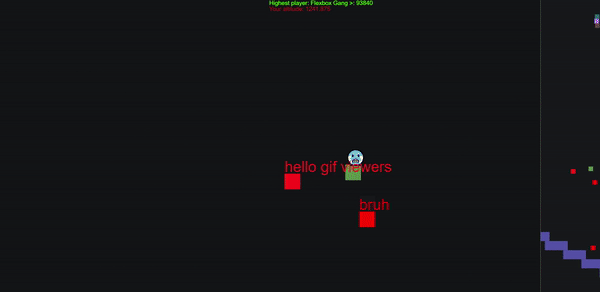

# mattblock

# Changelog
- 2022-09-17:
    - Refactor (Single Responsibility Principle)
    - Simplify the collision detection
    - Detect high-velocity collisions (collision but no overlap)
    - Add test server
- 2022-09-16: Add changelog and intro gif
- 2022-09-15: Switch to HTTPS (https://mattblock.io)
- 2022-09-13: Add minimap
- 2022-09-08: Recalibrate game upon zoom
- 2022-09-07: Add high score and altitude indicators
- 2022-09-02:
    - Scroll screen only when near an edge
    - Add player-player collision
- 2022-09-01: Add player-platform collision
- 2022-08-31:
    - Right click to change name
    - Assign player's old character when they join again
    - Save world to disk
- 2022-08-30:
    - Keep player centered on screen
    - Add jump
- 2022-08-29:
    - Sync player positions over the Internet
    - Right click to change color
    - Add gravity and ground
- 2022-08-28:
    - Create game loop
    - Draw a square

# Unorganized (don't look) (okay you can look)

### Critical
- [ ] Show tutorial
- [ ] Quest to the upper left
- [ ] Quest to the upper right
### Information
- [ ] 💤 if logged off. Tiny. In bottom right of character. Part of profile object.
- [ ] Right click shows player list, with coordinates
- [ ] Show controls upon right click
- [ ] Help players find each other, e.g. via a compass or minimap.
### Mechanics
- [ ] Make a more precise jump, via holding.
- [ ] Let players push other players
### Bugs
- [ ] Players fall through each other if they have the same x-position. Could solve spawn area problem by having players stack
    - [ ] Consider adding a random tiny value after each movement, to avoid exact x-coordinate
- [ ] Keep spawn area clear for new people. If someone logs out from the spawn area, move them somewhere.
### Zooming
- [ ] Maybe have a min and max zoom. Or just make sure the important icons scale, to avoid limiting players.
- [ ] Press "M" to bring up the full map
---
- [ ] Create a command to spawn a second character from the spawn machine, to make testing easier.
---
- [ ] Make world space y point up. Flip to get to screen space.
---
- [ ] Teamwork example: Double jump off each other.
---
### Maybe
- [ ] Spawn platforms from the server. Press a button to randomize them. Can sync with refreshing
- [ ] Interpolate remote player character positions
- [ ] Splitscreen
- [ ] Randomly place emojis in the world. Players unlock by touching them. Right click to show unlocked emojis.
- [ ] The more emojis you have, the higher you can jump. Hold space to use full jump. Tap to use standard minimum jump.
- [ ] Can give people some of your emojis. Emojis are currency.
- [ ] Push an object together
    - [ ] Go underneath a big object together and jump to push it up
